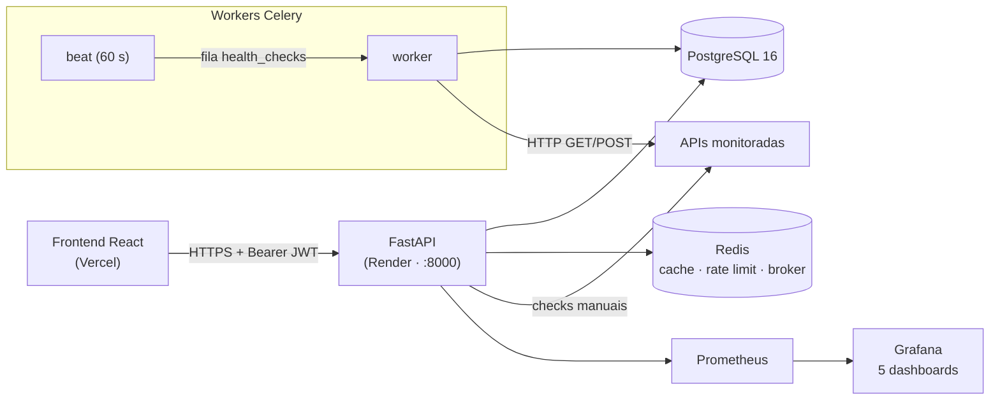

<div align="center">

# ForgeOps Backend

**API da plataforma de monitoramento e observabilidade de APIs HTTP.**

[](https://github.com/Juholiver/ForgeOps-BackEnd/actions/workflows/ci.yml)
[](#testes-e-qualidade)
[](#testes-e-qualidade)
[](https://www.python.org/)
[](https://fastapi.tiangolo.com/)
[](#licença)

</div>

---

## Visão geral

Repositório **backend** do ForgeOps: uma API REST assíncrona (FastAPI + SQLAlchemy 2 + PostgreSQL) que cria monitores de API, executa health checks **manuais e agendados**, calcula métricas de uptime/latência, gera incidentes e expõe tudo com **autenticação Google OAuth 2.0** e **isolamento multiusuário**.

- **Frontend (React + Vite):** [`Juholiver/ForgeOps`](https://github.com/Juholiver/ForgeOps) — em produção na Vercel
- **API em produção:** `https://forgeops-backend-1.onrender.com` — Render (Docker)
- **Documentação interativa:** `GET /docs` (Swagger UI)

## Destaques

- 🔐 **Login exclusivo via Google OAuth 2.0** — `state` assinado (HMAC, 10 min), troca de `code` por tokens e JIT provisioning de usuário (match por `google_id` → `email`)
- 👥 **Multiusuário com isolamento por `user_id`** — todos os recursos de dados filtrados por dono; recurso de outro usuário retorna `404` (não vaza existência)
- ❤️ **Health checks** — execução sob demanda pela API/UI e agendada a cada **60 s** via Celery beat, com validação de status HTTP esperado, timeout configurável e proteção **SSRF**
- 📈 **Analíticas** — uptime, latência (média/p95/p99), disponibilidade e histórico de checks por monitor (7/30 dias)
- 🚨 **Incidentes** — abertura, investigação e resolução com trilha de auditoria
- 🛡️ **Segurança** — JWT HS256 (access 30 min / refresh 7 dias), bcrypt, rate limit **100 req/60 s por IP** (fail-open sem Redis), security headers, CORS por allowlist e validação fail-fast de secrets em produção
- 📊 **Observabilidade** — `/metrics` Prometheus, logs estruturados (`structlog`) com `X-Request-ID` correlacionado e 5 dashboards Grafana provisionados
- ✅ **Qualidade** — 126 testes, cobertura 90%, `ruff` (lint+format), `mypy` strict e CI/CD em GitHub Actions

## Arquitetura



## Stack

| Camada | Tecnologia |
|--------|-----------|
| API | Python 3.12+, FastAPI, Pydantic v2 |
| Banco | PostgreSQL 16 (fallback SQLite para dev local) |
| Cache / locks / filas | Redis 7 (broker e result backend do Celery) |
| Jobs agendados | Celery worker + beat (fila `health_checks`) |
| Migrações | Alembic (3 revisões, executadas no boot com `RUN_MIGRATIONS=1`) |
| Observabilidade | Prometheus, Grafana, structlog |
| Testes | Pytest + pytest-asyncio + coverage |
| Qualidade | Ruff (lint/format), MyPy strict |
| Deploy | Docker, Docker Compose, GitHub Actions, Render + Vercel |

## Início rápido

### Opção A — desenvolvimento leve (sem Docker, SQLite)

```bash
python -m venv .venv
source .venv/bin/activate        # Windows: .venv\Scripts\activate

pip install -e ".[dev]"
cp .env.example .env             # mantenha DB_BACKEND=sqlite

uvicorn app.main:app --reload
```

A API sobe em `http://localhost:8000` (docs em `/docs`).

### Opção B — stack completa (Docker Compose)

```bash
# uma única vez por máquina: rede compartilhada com o frontend
docker network inspect forgeops >/dev/null 2>&1 || docker network create forgeops

cp .env.example .env
docker compose up -d --build
```

Serviços: `backend` (:8000), `worker`, `scheduler`, `postgres` (:5432), `redis` (:6379),
`rabbitmq` (legado/ocioso), `prometheus` (:9090) e `grafana` (:3000 — admin/admin).

## Variáveis de ambiente

O arquivo [`.env.example`](.env.example) documenta todas. Principais:

| Variável | Padrão | Descrição |
|----------|--------|-----------|
| `APP_ENV` | `development` | `production` ativa validação fail-fast de secrets |
| `APP_SECRET_KEY` | `change-me-in-production` | Chave dos JWTs (**obrigatória em produção**) |
| `DB_BACKEND` | `postgres` | `postgres` ou `sqlite` (dev sem Docker) |
| `POSTGRES_*` | `forgeops` | Host/porta/banco/usuário/senha do PostgreSQL |
| `REDIS_HOST/PORT/DB` | `localhost` | Redis usado para cache, rate limit e broker Celery |
| `RABBITMQ_*` | `forgeops` | **Legado** — broker migrou para Redis; `RABBITMQ_PASSWORD` ainda é validado em produção |
| `CORS_ORIGINS` | `["http://localhost:3000"]` | Allowlist de origens do frontend (JSON) |
| `GOOGLE_CLIENT_ID` / `GOOGLE_CLIENT_SECRET` | — | Credenciais OAuth 2.0 do Google Cloud |
| `GOOGLE_REDIRECT_URI` | `http://localhost:8000/auth/google/callback` | URI de redirect registrada no Google Cloud |
| `FRONTEND_URL` | `http://localhost:3000` | Origem que recebe `/auth/callback?access_token=...` |
| `RUN_MIGRATIONS` | `0` | `1` executa `alembic upgrade head` no boot do container |
| `BACKEND_IMAGE` | `forgeops-backend:local` | Imagem usada pelo compose (definida pelo CD) |

Produção self-hosted (overlay): preencha `.env.prod` com `openssl rand -hex 32`/`16` para os
secrets e suba com

```bash
docker compose -f docker-compose.yml -f docker-compose.prod.yml --env-file .env.prod up -d
```

O overlay remove todas as portas públicas (só rede interna) e fixa `restart: unless-stopped`.

## Autenticação — Google OAuth 2.0

Login exclusivo via Google na UI (sem e-mail/senha):

1. `GET /auth/google` → redirect para o consentimento com `state` assinado por HMAC (expira em 10 min).
2. `GET /auth/google/callback` → troca o `code` por tokens (`httpx`), lê o userinfo e **encontra ou cria** o usuário (match por `google_id`, depois por `email`; criado com `password_hash=NULL` e role `viewer`).
3. Emite os JWTs e redireciona **307** para `{FRONTEND_URL}/auth/callback?access_token=...&refresh_token=...`.

Os endpoints clássicos `POST /auth/register`, `POST /auth/login`, `POST /auth/refresh` e
`GET /auth/me` permanecem intactos — a autenticação por senha continua funcionando e usuários
Google vinculam o `google_id` a uma conta existente pelo e-mail.

**Configuração no Google Cloud (uma vez):**

1. Crie um projeto no [Google Cloud Console](https://console.cloud.google.com/).
2. **APIs & Services → OAuth consent screen** — preencha (em *Testing*, adicione o e-mail como *Test user*).
3. **APIs & Services → Credentials → OAuth client ID** — tipo **Web application**.
4. Em **Authorized redirect URIs**, adicione exatamente `GOOGLE_REDIRECT_URI` (`.../auth/google/callback`).
5. Copie *Client ID* e *Client secret* para o `.env` e reinicie a API.

### Isolamento multiusuário

- Todo endpoint de dados exige `Authorization: Bearer <access_token>` (dependência `get_authenticated_user`).
- Consultas filtram por `monitors.user_id`; `check_results`, `incidents` e agregados do dashboard são isolados via join com o monitor do usuário.
- Sem token → `401`; recurso de **outro usuário** → `404` (não vaza existência).
- `GET /audit` devolve apenas os próprios logs; administradores podem filtrar por `user_id`.
- Workers Celery operam no lado do sistema (lêem todos os monitores ativos); o isolamento vale para a API de leitura.

## API

| Grupo | Endpoints | Auth |
|-------|-----------|------|
| Auth | `POST /auth/register`, `POST /auth/login`, `POST /auth/refresh`, `GET /auth/google`, `GET /auth/google/callback` | pública |
| | `GET /auth/me` | Bearer |
| Monitores | `POST /monitors`, `GET /monitors`, `GET/PATCH/DELETE /monitors/{id}`, `POST /monitors/{id}/toggle` | Bearer |
| Health checks | `POST /health-check/{id}`, `POST /health-check/run-all` | Bearer |
| Dashboard | `GET /dashboard/summary`, `/uptime/{id}`, `/latency/{id}`, `/availability/{id}`, `/history/{id}`, `/incidents` | Bearer |
| Incidentes | `GET /incidents`, `GET /incidents/{id}`, `PATCH /incidents/{id}` | Bearer |
| Auditoria | `GET /audit` | Bearer (admin filtra por `user_id`) |
| Observabilidade | `GET /health`, `GET /health/db`, `GET /ready`, `GET /metrics` | pública |

Documentação interativa em `/docs` (Swagger) e `/redoc`.

## Modelo de dados

| Tabela | Papel | Campos-chave |
|--------|-------|--------------|
| `users` | Contas (Google ou senha) | `email` único, `password_hash` anulável, `google_id`, `role` (`admin`/`viewer`), `is_active` |
| `monitors` | API monitorada (por usuário) | `url`, `method`, `interval_seconds` (10–3600), `timeout_seconds`, `expected_status`, `active`, `user_id` |
| `check_results` | Execução de health check | `status` (`up`/`down`/`error`/`timeout`), `http_status`, `response_time_ms`, `error_message`, `checked_at` |
| `incidents` | Falha detectada | `status` (`open`/`investigating`/`resolved`), `reason`, `started_at`, `resolved_at` |
| `audit_logs` | Trilha de auditoria | `user_id`, `action`, `resource`, `resource_id`, `metadata` |

Migrações Alembic: `0001_initial_schema` → `0002_performance_indexes` → `0003_google_oauth_isolation`.

## Workers Celery

- **Broker/result:** Redis (`celery_app.py`); RabbitMQ permanece no compose apenas como legado.
- **Fila:** `health_checks` (fila padrão e dedicada às duas tasks).
- **Agendamento:** `beat` dispara `run_all_health_checks` a cada **60 s**, que agenda `run_health_check` para cada monitor ativo (fan-out com `.delay`).
- **Regras:** compara `http_status` com `monitor.expected_status` (mismatch grava `status=error`), grava `check_results` e emite métricas `celery_tasks_total` / `celery_task_duration_seconds`.
- **Confiabilidade:** `task_acks_late`, `task_reject_on_worker_lost`, `time_limit=300s`, retries=3, `worker_prefetch_multiplier=1`.
- **Incidentes:** a abertura/resolução acontece no serviço da API (`process_check_result`, chamado
  a cada check executado pela API); a task do worker grava apenas o resultado em `check_results`.

```bash
# local (já vem no compose como serviços worker + scheduler)
celery -A app.workers.celery_app.celery_app worker -l INFO -Q health_checks
celery -A app.workers.celery_app.celery_app beat -l INFO
```

> **Produção atual (Render free):** a API roda sem `worker`/`beat` — os checks agendados ainda
> não disparam sozinhos em produção (Etapa 5, workers pagos). Enquanto isso, os checks são
> executados sob demanda pela UI (`POST /health-check/{id}`).

## Segurança

| Controle | Implementação |
|----------|---------------|
| Sessão | JWT HS256 — access **30 min**, refresh **7 dias** (`app/infrastructure/security.py`) |
| Senhas | bcrypt (fluxo de registro/senha) |
| SSRF | `SSRFProtection` bloqueia loopback, link-local, IPs privados/reservados/multicast e hostnames como `metadata.google.internal` (resolve DNS antes de checar) |
| Rate limit | 100 requisições/60 s por IP via Redis — **fail-open** se o Redis estiver indisponível |
| Headers | `X-Content-Type-Options`, `X-Frame-Options: DENY`, HSTS, CSP `default-src 'self'`, `Referrer-Policy`, `Permissions-Policy` |
| CORS | Allowlist explícita via `CORS_ORIGINS` + credenciais |
| Fail-fast | `APP_ENV=production` valida `APP_SECRET_KEY`, `POSTGRES_PASSWORD` e `RABBITMQ_PASSWORD` no boot |
| Exposição | Recurso de outro usuário responde `404`; handler global converte exceções em `500` sem vazar stack |

## Observabilidade

- **`GET /metrics`** — métricas HTTP (`MetricsMiddleware`) e de Celery no formato Prometheus.
- **Logs estruturados** — `structlog` com `X-Request-ID` gerado/propagado por request.
- **`GET /health`** (liveness), **`GET /health/db`** (connectividade do banco) e **`GET /ready`** (readiness).
- **Grafana provisionado** (`monitoring/grafana`) com 5 dashboards: `requests`, `latency`, `uptime`, `incidents`, `workers`; datasource Prometheus automático.

## Testes e qualidade

```bash
# lint + formatação
ruff check .
ruff format --check .

# tipagem (strict)
mypy app/

# testes — 126 testes, cobertura 90%
pytest tests/ --cov=app --cov-report=term-missing
```

A suíte cobre auth (Google + senha), isolamento multiusuário, monitores, checks, dashboard,
incidentes, auditoria e workers — com mock do exchange OAuth (nenhum teste depende de rede).

## CI (GitHub Actions)

Workflow [`ci.yml`](.github/workflows/ci.yml), a cada push/PR para `main`:

| Job | O que faz |
|-----|-----------|
| `lint` | `ruff check` + `ruff format --check` |
| `typecheck` | `mypy app/` (strict) |
| `test` | `pytest` com cobertura |
| `compose-validate` | `docker compose config` (base + overlay de produção) |
| `docker-build` | Build da imagem backend (sem push) |

## CD (GitHub Actions)

Workflow [`cd.yml`](.github/workflows/cd.yml):

1. **Publish** (push em `main` ou tag `v*.*.*`): build e push da imagem para
   `ghcr.io/<owner>/forgeops-backend` com tags `sha-<commit>`, `latest` e a versão semver.
2. **Deploy** (somente com repo variable `DEPLOY_ENABLED=true`): sync dos compose/monitoring por
   SSH, garantia da rede `forgeops`, pull da imagem `sha-<commit>` exata e restart dos serviços.

Secrets/variables: `DEPLOY_ENABLED` (variable), `DEPLOY_HOST`, `DEPLOY_USER`, `DEPLOY_SSH_KEY`,
`DEPLOY_PATH`, `DEPLOY_PORT` (opcional). Provisionamento do servidor: criar a rede `forgeops` e
o `.env.prod` fora do git (`/opt/forgeops/.env.prod`).

## Produção (estado atual)

| | |
|---|---|
| **API** | Render Web Service (Oregon) — build pelo `Dockerfile` deste repositório, `CMD uvicorn` na **porta 8000**, `RUN_MIGRATIONS=1` aplica o Alembic no boot |
| **Banco** | PostgreSQL gerenciado da Render (migrações `0001→0003` no primeiro deploy) |
| **Redis** | Render Key Value (Redis compatível) para cache/rate limit/broker |
| **Frontend** | Vercel — variável `VITE_API_URL` apontando para a API; origem liberada em `CORS_ORIGINS` |
| **Google OAuth** | `GOOGLE_REDIRECT_URI=https://forgeops-backend-1.onrender.com/auth/google/callback` registrada no Google Cloud |
| **Limites do plano free** | API dorme após 15 min de inatividade (~1 min de wake) e **não há worker/beat** — checks agendados ficam para a Etapa 5 (Background Workers) |

## Estrutura do repositório

```
.
├── app/
│   ├── api/              # rotas + middlewares (auth, monitors, dashboard, incidents...)
│   ├── application/      # serviços de negócio
│   ├── domain/           # modelos SQLAlchemy + schemas Pydantic
│   ├── infrastructure/   # repositórios, OAuth Google, SSRF, Redis, segurança
│   ├── core/             # settings (pydantic-settings)
│   └── workers/          # celery_app, tasks, beat, worker
├── alembic/              # migrações (0001 → 0003)
├── tests/                # suíte pytest (126 testes)
├── monitoring/           # provisioning do Prometheus + Grafana (5 dashboards)
├── .github/workflows/    # ci.yml e cd.yml
├── docker-compose.yml    # stack local completa
├── docker-compose.prod.yml  # overlay de produção
├── Dockerfile            # python:3.12-slim, porta 8000
├── docker-entrypoint.sh  # espera o Postgres + alembic upgrade (RUN_MIGRATIONS=1)
└── pyproject.toml        # dependências, ruff, mypy, pytest
```

## Licença

MIT
